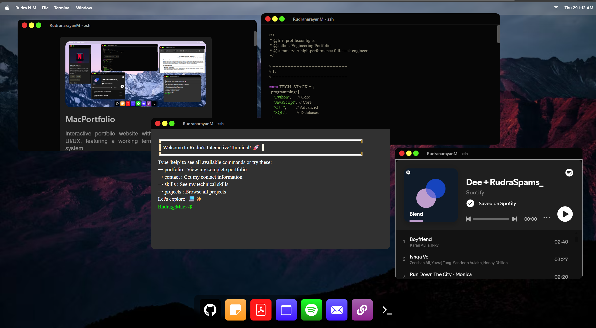

# 🖥️ MacPortfolio

A modern, macOS-inspired portfolio website showcasing my projects, skills, and professional journey. Built with React and Vite for optimal performance and developer experience.

[](https://rnmacportfolio.onrender.com)
[](https://reactjs.org/)
[](https://vitejs.dev/)
[](LICENSE)



---

## ✨ Features

- 🎨 **macOS-Inspired UI** - Clean, intuitive interface mimicking macOS design
- 📱 **Fully Responsive** - Optimized for desktop, tablet, and mobile devices
- ⚡ **Fast Performance** - Built with Vite for lightning-fast load times
- 🖼️ **Interactive Components** - Draggable windows and dynamic content
- 💻 **Terminal Emulator** - Interactive console for unique user experience
- 📝 **Markdown Support** - Rich content display with syntax highlighting
- 🎯 **Project Showcase** - Detailed presentation of academic and personal projects

---

## 🛠️ Tech Stack

### Frontend

- **React** 19.2.0 - UI library
- **Vite** 7.2.4 - Build tool & dev server
- **Sass** 1.97.2 - CSS preprocessor

### Key Dependencies

- `react-rnd` - Draggable & resizable components
- `react-console-emulator` - Terminal interface
- `react-markdown` - Markdown rendering
- `react-syntax-highlighter` - Code syntax highlighting

### Development Tools

- ESLint - Code linting
- Vite Plugin React - Fast refresh & JSX support

---

## 🚀 Getting Started

### Prerequisites

- **Node.js** (v14 or higher)
- **npm** or **yarn**

### Installation

1. **Clone the repository**

```bash
git clone https://github.com/YOUR_USERNAME/MacPortfolio.git
cd MacPortfolio
```

2. **Install dependencies**

```bash
npm install
```

3. **Start development server**

```bash
npm run dev
```

The app will be available at `http://localhost:5173`

---

## 📦 Available Scripts

| Command           | Description                      |
| ----------------- | -------------------------------- |
| `npm run dev`     | Start development server         |
| `npm run build`   | Build for production             |
| `npm run preview` | Preview production build locally |
| `npm run lint`    | Run ESLint for code quality      |

---

## 🌐 Deployment

This project is configured for easy deployment to **Render.com**. See [DEPLOY.md](DEPLOY.md) for detailed instructions.

### Quick Deploy to Render

1. Push to GitHub
2. Connect repository to Render
3. Configure:
   - **Build Command**: `npm install && npm run build`
   - **Publish Directory**: `dist`

**Live Demo**: Coming soon on Render.com

---

## 📂 Project Structure

```
MacPortfolio/
├── public/              # Static assets
│   ├── notes.txt       # Profile configuration
│   └── *.avif          # Images & media
├── src/
│   ├── assets/         # Project assets
│   │   └── resume.pdf  # Resume file
│   ├── components/     # React components
│   ├── main.jsx        # App entry point
│   └── *.scss          # Styles
├── render.yaml         # Render deployment config
├── vite.config.js      # Vite configuration
└── package.json        # Dependencies
```

---

## 👨‍💻 About Me

**Rudra Narayan Mondal**  
B.Tech Computer Science Student | Full-Stack Developer | AI Enthusiast

### 🎯 Core Skills

- **Languages**: Python, JavaScript, C++, SQL
- **Frontend**: React, Next.js, HTML/CSS/JS


### 🏆 Featured Projects

- **Bloom AI** - Next.js chatbot with QR authentication
- **Jarvis AI Bot** - MERN voice assistant with GPT-3.5
- **Football Sentiment Tracker** - NLP-based sentiment analysis

---

## 📜 License

This project is licensed under the **MIT License** - see the [LICENSE](LICENSE) file for details.

---

## 📧 Contact

- **Email**: rudranarayanmondal20@gmail.com
- **GitHub**: [@YOUR_USERNAME](https://github.com/Rudra-CSER)
- **LinkedIn**: [Your LinkedIn](https://linkedin.com/in/rudra-narayan-mondal-0b8b3b2b2)

---

## 🙏 Acknowledgments

- Design inspiration from macOS Big Sur
- Icons and assets from various open-source projects
- Built with ❤️ using React and Vite

---

<div align="center">

**⭐ Star this repo if you find it helpful!**

Made with 💻 by Rudra Narayan Mondal

</div>
